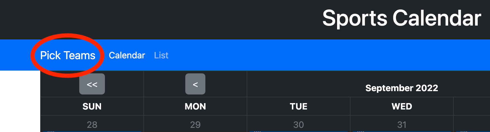
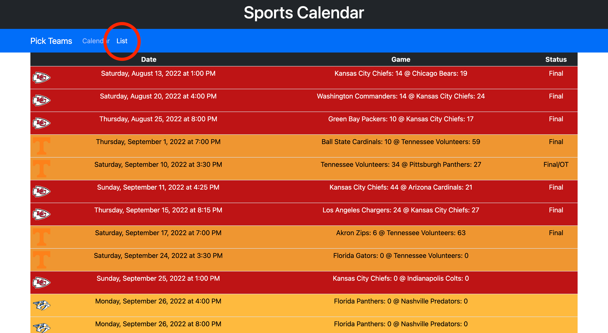

# Sports Calendar

<https://thadkingcole.github.io/sports-calendar>

#### Video Demo: <https://youtu.be/WToJvGRM0f8>

#### Description:

As an avid sports fan of many teams across several leagues, I find it difficult to keep track of when my teams are playing their games. Many sports websites exist that have that information, but they also have a lot of other information that I do not care about such as betting odds, fantasy stats, news articles, and advertisements. Their sites are often well designed and run efficiently, but I still have to click through several pages to look at the schedules of each team I follow. For my project, I chose to create a single page website that complies my favorite teams’ schedules together into one convenient view. Since I wanted the site to work as a single page web app, I decided to use [React](https://reactjs.org) which is a JavaScript framework originally developed by Facebook. I also utilized some ESPN API endpoints to get a list of teams and their schedules.

## Usage

When the user first loads the page, they are greeted by an empty calendar. The user can pick their favorite teams by clicking `Pick Teams` at the top left of the page.



This brings up a menu where the user can select each team from each of the available leagues:

- MLB
- NBA
- NCAA Football
- NFL
- NHL


Once the user clicks on the desired league, a list of teams in that league is displayed along with a checkbox for each team. Clicking on the checkbox adds the team to the user’s calendar.


The user can select and deselect as many teams as desired across any combination of supported leagues. Once the user is done with their selections, each selected teams’ games will be shown on the calendar view.


The user can change months by clicking the `<` and `>` buttons and can change years by clicking the `<<` and `>>` buttons.

Users can also select a list view of their teams’ games by clicking `List` in the top-left part of the page. This view gives the user a chronological list of their teams’ games including the score of the game and whether the game is in progress or has gone final.



Users only have to select their favorite teams once as that data is saved to the browser’s [localStorage](https://developer.mozilla.org/en-US/docs/Web/API/Window/localStorage). This way, the browser remembers which teams are their favorite and will load their schedules the next time they visit this app.

**NOTE:** User data is not saved to any external source, only on the user's own device. This is nice for privacy, but it also means that favorite teams are not remembered when visiting this app on different devices or on different browsers. This funcationality could be added in the future, but for now it is considered to be a feature and not a bug.

That is about all there is to the app. What follows is more details on the development of the app and what each file does.

## Style Decisions

During development, a list view was created since it was much simpler to develop than a calendar view. This allowed me to display game data on the page much quicker than it would have taken with the calendar view, and this helped greatly with debugging how games were being fetched from the ESPN API. In fact, the list view was so convenient that I almost did not create the calendar view as I thought it may be too difficult to develop. In the end, the calendar view ended up not being as challenging as I initially thought, and since I also liked the list view, I decided to give the user the option of using either view they prefer.

I also debated how I was going to present the list/calendar of games to the user in a way that the user would easily know which team is playing in which game. Ultimately, I decided to use the team’s primary color as a background for the game information involving that team (e.g. using orange for each University of Tennessee football game). The primary color was available in the ESPN API data as a hex code. From there, I used a solution found at <https://wunnle.com/dynamic-text-color-based-on-background> that calculates whether to use black or white text based on the background color contrast. This solution makes the game information readable no matter what the team’s primary color might be. If Tennessee orange is being used, then black text will work great, and if the Kansas City Chiefs red does not work with black text, it will automatically use white text instead.


Because I was using several different ESPN API endpoints to get information on many teams across many leagues, the data returned were not always of uniform structure. I believe I have found and corrected many of the inconsistencies using logic or placeholder data, but if you find something not displaying correctly or at all, bugs may be reported to thadcole@duck.com.

## Files

The file structure was generated with [create-react-app](https://create-react-app.dev/) using the following command:

```
npx create-react-app
```

From there, unnecessary files were deleted until just the required files remained. I then created additional files as I worked through development until I arrived at the current file structure:

### Root ~

This is the beginning of the file tree and contains directories and standalone files as described below.

- `public/`
  - `index.html` - The html template used by React.
  - `favicon.ico` - Image used as the icon seen in the browser tab.
  - `robots.txt` - A text file that gives directions to web-crawling bots on how they can interact wtih this webpage.
- `screenshots/` - This directory holds the various images used in this README markdown file.
- `src/` - This directory holds the bulk of the working code for the app.
  - `components/` - This directory holds the code for each React functional component written for the app.
    - `Games/` - This component consists of the `Cal` and `List` components.
      - `Cal/`
        - `calendar.css` - Defines custom style for the calendar view.
        - `index.js` - Defines how the calendar view is displayed on the page with the user selected teams' games.
      - `List/`
        - `index.js` - Defines how the list view is displayed on the page with the user selected teams' games.
        - `list.css` - Defines custom style for the list view.
      - `index.js` - Passes game data from further up the component tree to the user selected calendar or list view.
    - `TeamPicker/`
      - `index.js` - Consists of the blue navbar containing the team selection offcanvas. Allows the user to select each desired team from the available leagues by clicking the respective checkboxes.
    - `Top/`
      - `index.js` - Consists of the black "Sports Calendar" header at the top of the page
  - `tools/`
    - `constants.js` - A lookup table of key-value pairs where the league names are keys and their respective sports are values. E.g., `mlb` is assigned the value `baseball` and `nfl` is assigned the value `football`. This structure is helpful with many of the ESPN API endpoints.
    - `textColor.js` - Implements the solution described at <https://wunnle.com/dynamic-text-color-based-on-background> for dynamically selecting black or white font depending on the background color contrast.
  - `App.js` - Defines the top level structure of the web app and the components that comprise it. This file also initializes the state from localStorage (if one exists) and passes that state down to each component that needs it.
  - `index.js` - Initializes the React framework and renders the app as defined in `~/src/App.js`.
- `.gitignore` - A list of file types for git to ignore during commits and other git operations.
- `package-lock.json` - This file is generated by `npm install` and it helps verify that the correct versions of each npm module is installed within `~/node_modules/`
- `package.json` - This file contains information about this app including npm scripts and which node modules should be installed.
- `README.md` - This is the current file you are reading and documents how to use the app, some of the design choices made, and what each file does.
